# Hands-on Lab 03
# Exercise 7: Deploying Azure Arc Data Controller with direct connectivity mode 
### Estimated Duration: 40 Minutes  

In this exercise, you will be connecting an existing Kubernetes cluster to Azure using Azure Arc-enabled Kubernetes. You will be deploying an Azure data controller in direct connectivity mode to a custom location using Azure portal and Azure CLI.

## Objectives

In this exercise, you will be performing the following tasks:

- Task 1: Log in to Azure and install Azure CLI extensions.
- Task 2: Onboard an existing Kubernetes cluster to Azure using Azure Arc-enabled Kubernetes
- Task 3: Create a custom location on the Azure Arc-enabled Kubernetes cluster
- Task 4: Deploy Azure Arc Data Controller in directly connected mode using Azure Portal
- Task 5 : Monitor the creation of Azure Arc data controller on the cluster

## Task 1: Connect an existing Kubernetes cluster to Azure using Azure Arc-enabled Kubernetes

1. Open **Windows PowerShell** by double-clicking on the **Windows PowerShell** icon from the desktop of your ARCHOST VM and run the below command to log in to Azure.

    
    
    ```
    az login
    ```
    
1. After running the above command a browser tab will open to login to the Azure portal.

1. On the **Sign into Microsoft Azure** tab you will see the login screen. Enter the following **Email/Username** and then click on **Next**.

   * Email/Username: <inject key="AzureAdUserEmail"></inject>

1. Now enter the following **Password** and click on **Sign in**.

   * Password: <inject key="AzureAdUserPassword"></inject>

1. After adding the credentials you will see that you have logged into Microsoft Azure.

    

1. Now switch back to Windows PowerShell and you will be able to see that you have logged in to Azure.

1. Navigate to **arcadmin** using the below command.
   
   ```
    cd C:\Users\arcadmin 
   ```  
    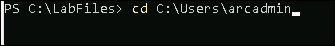

1. Run the below command to upgrade the `az` extension.

   ```
   az upgrade
   ```
   
   >If promted the Installation pop up, check the **I accept the terms in License Agreement (1)** and click **Install(2)**
   >It may take some time, Wait till the installation process get completed.
     
   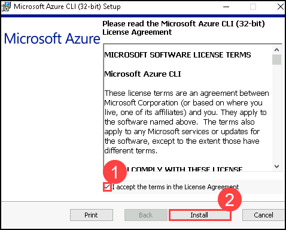
   
   >Click on **Finish** to complete the process.
     
   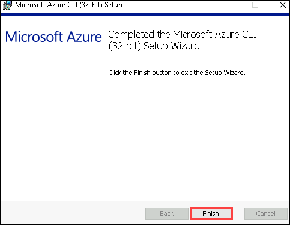    
   
1. Run the below commands to install the required Azure CLI extensions.
   
   ```
   az extension add --name k8s-extension
   az extension add --name connectedk8s
   az extension add --name k8s-configuration
   az extension add --name customlocation   
   ```   
  
    
   
1. Now run the below command to get the latest version of extensions.
  
   ```
   az extension update --name k8s-extension
   az extension update --name connectedk8s
   az extension update --name k8s-configuration
   az extension update --name customlocation
   az extension update --name arcdata 
   ```
   
1. You can validate that you have all the required extensions with the latest versions by running the below command:
   
   ```
   az version
   ```     
    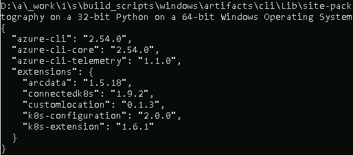
   
1. After confirming that the required tools are installed, the next step is to register your subscription with Arc for Kubernetes.

1. Run the below commands to register the required resource providers if not already registered.

   ```
   az provider register --namespace Microsoft.Kubernetes
   az provider register --namespace Microsoft.KubernetesConfiguration
   az provider register --namespace Microsoft.ExtendedLocation
   ``` 
   
    
   
## Task 2: Onboard an existing Kubernetes cluster to Azure using Azure Arc-enabled Kubernetes

In this task, you will be connecting an existing Kubernetes cluster to Azure using Azure Arc-enabled Kubernetes and will be enabling custom features by adding an Azure Arc data services extension and a custom location on the Azure Arc-enabled Kubernetes cluster.

1. Run the below command to import the Kubernetes cluster credentials in the environment.

   ```
   Import-AzAksCredential -ResourceGroupName $env:resourceGroup -Name Arc-Data-Demo-DirectMode -Force
   ```

1. Run the below command to connect the existing Kubernetes to your Azure subscription using Azure Arc-enabled Kubernetes. Once you have run the command, it will take a few minutes to onboard the cluster to Azure Arc.

   ```
   az connectedk8s connect --name Arc-Data-Demo-DirectMode --resource-group azure-arc
   ```
   > **Info**: In the above step, you have connected your existing Azure Kubernetes cluster to Azure Arc, to get the available AKS cluster deployed on Azure, you can use the command ```az aks list```.
  
   > **Note:** We have already defined your Cluster name and Azure resource group name in the above commands. If you are trying this in your subscription, please make sure that you have entered the correct details. This can take up to 5 minutes to complete. 

1. Once the previous command is executed successfully, the provisioning state in output will show as succeeded.
   
    

1. Verify whether the Azure Arc-enabled Kubernetes cluster is onboarded and connected to the resource group in the Azure subscription by running the following command:

   ```
   az connectedk8s list -g azure-arc -o table
   ```  
  
    

     >**Note**: If you encounter the following error, run the commands below to complete the Azure CLI installation process, and then try executing the previous command again.
    
    ```
    az upgrade
    az extension update --name connectedk8s
    ```
    

     >If promted the Installation pop up, check the **I accept the terms in License Agreement (1)** and click **Install(2)**
     >It may take some time, Wait till the installation process get completed.
     
     
   
     >Click on **Finish** to complete the process.
     
          
   
   
1. Azure Arc-enabled Kubernetes deploys a few operators into the azure-arc namespace. You can view these deployments and pods by running the command in the command prompt:  

    > **Note**: A Kubernetes operator is an application-specific controller that extends the functionality of the Kubernetes API to create, configure, and manage instances of complex applications on behalf of a Kubernetes user.

   ```
   kubectl -n azure-arc get deployments,pods
   ```
   
   The output should be similar to as shown below:    
  
    

1. Navigate to the Resource Group from the Azure portal navigation pane and click on the Resource Group named azure-arc. Look for the resource named **Arc-Data-Demo-DirectMode** of resource type Azure Arc-enabled Kubernetes resource.

    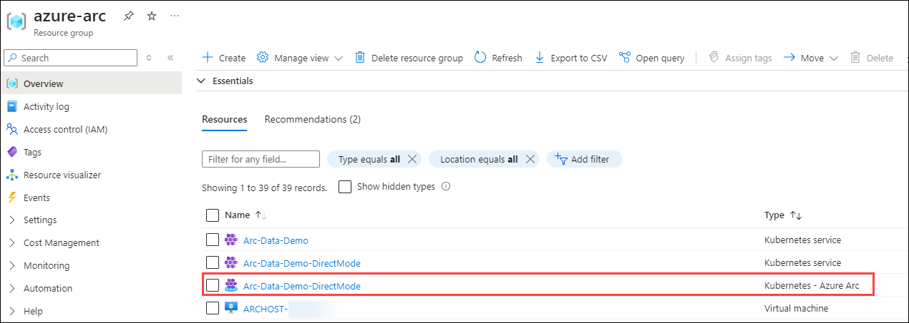
     
    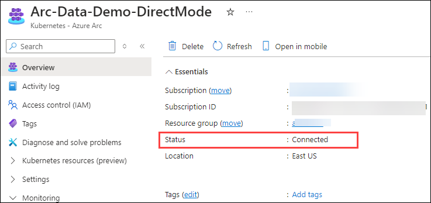

## Task 3: Create a custom location on the Azure Arc-enabled Kubernetes cluster

   Custom Locations provides administrators a way to deploy Azure Arc data services and other Azure Arc-enabled services to their locations, similar to Azure locations.

1. Now run the below command to enable features to create the custom location:

     ```
     az connectedk8s enable-features -n Arc-Data-Demo-DirectMode -g azure-arc --features cluster-connect custom-locations
     ```
     
    The output should be similar to as shown below:**"Successfully enabled features: ['cluster-connect', 'custom-locations'] for the Connected Cluster Arc-Data-Demo-DirectMode"**
   
    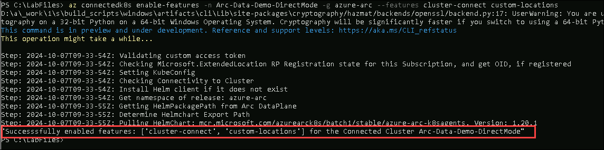   
        
   > **Note**: The Custom Locations feature is dependent on the Cluster Connect feature. So, both features have to be enabled for custom locations to work. Also, az connectedk8s enable features need to be run on a machine where the kubeconfig file is pointing to the cluster on which the features are to be enabled.
    
1. Run the below command to deploy the extension of Azure Arc-enabled Data Services on the Azure Arc Kubernetes cluster.
  
     ```
    az k8s-extension create --name azdata --extension-type microsoft.arcdataservices --cluster-type connectedClusters -c Arc-Data-Demo-DirectMode -g azure-arc --scope cluster --release-namespace azure-arc --config Microsoft.CustomLocation.ServiceAccount=sa-bootstrapper --auto-upgrade false
     ```
   > **Note**: The above command will take up to 5 minutes to complete the creation of azdata extension, please wait for it to complete before proceeding to the next task.

1. After running the above command you will notice that the **Provisioning State** is **Succeeded**. If it is pending, it is because the extension may take a few minutes to complete the installation.
   
    

1. To verify the extension installation, switch back to the Azure Portal in the browser search for **Kubernetes - Azure Arc** and select your cluster.
   
    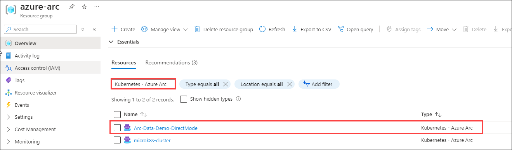
   
1. Now select **Extension** from the left side menu and check if the Install status is **Succeeded** or not. If it is not, please refresh after some time and then check.
   
    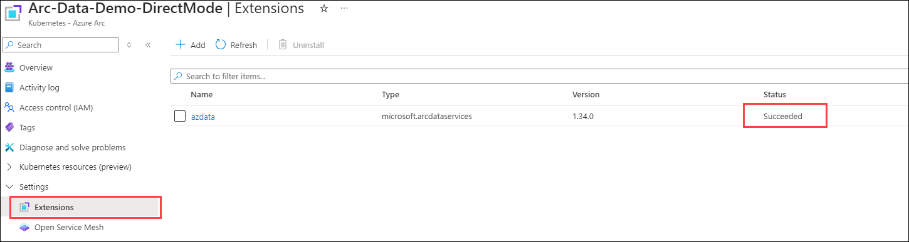

1. Now run the below command to get the Azure Resource Manager identifier of the Azure Arc-enabled Kubernetes cluster, you will be using the cluster-ID in the later steps while creating the custom location.

     ```  
     $clusterID = az connectedk8s show -n Arc-Data-Demo-DirectMode -g azure-arc  --query id -o tsv
     $clusterID
     ```
     
   > **Note:** The clusterID is stored in the $clusterID parameter and you will be using this parameter only in the later steps.
       
    
    
1. Now run the below command to get the Azure Resource Manager identifier of the cluster extension deployed on top of the Azure Arc-enabled Kubernetes cluster, referenced in the later steps as extensionId:

     ```
     $extensionID = az k8s-extension show --name azdata --cluster-type connectedClusters -c Arc-Data-Demo-DirectMode -g azure-arc --query id -o tsv
     $extensionID
     ``` 
   > **Note**: The extension resource ID is stored in the $extensionID parameter and you will be using this parameter only in the later steps.  
   
   
    
1. Now run the below command to create a custom location by referencing the Azure Arc-enabled Kubernetes cluster ID and the extension ID.

    ```  
    az customlocation create -n azurearc-nyc-location -g azure-arc --namespace azure-arc --host-resource-id $clusterID --cluster-extension-ids $extensionID
    ```
    
   > **Note:** This can take up to 2 minutes to complete the creation of a custom location
    The output should be as shown below:    
    
    
     
1. To verify the custom location deployment, switch back to the browser and log in to [Azure Portal](https://portal.azure.com) if not already done.

1. Search for **custom location** in the search bar and select custom locations.
   
    
      
1. After selecting the custom locations from the search bar, select your **azurearc-nyc-location**.

    
     
1. Explore the overview section. You can see the namespace and Kubernetes cluster details on the overview page.
  
    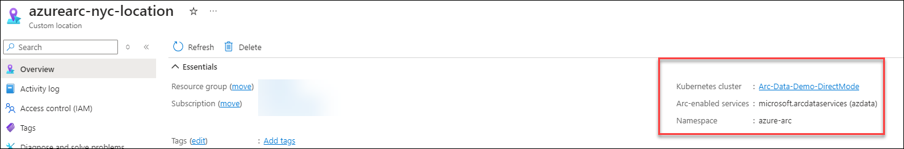

1. Now search for the **log analytics workspace** in the Azure portal.
     
    

1. Navigate to **LoganalyticsWS-Direct** workspace.
  
    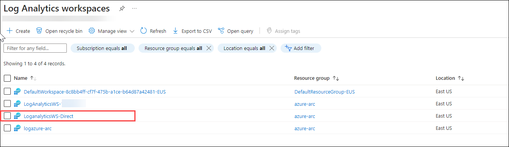

1. Select **Agents** **(1)** under Settings from the left side menu. In Windows servers **(2)** tab, under Log Analytics agent instructions copy the values of **Workspace ID** **(3)** and **Primary key** **(4)**. Save the values in a notepad for later use while creating the Azure arc data controller.

    
    
## Task 4: Deploy Azure Arc Data Controller in directly connected mode using Azure Portal

1. From the Azure Portal, search for **Azure arc data controllers** from the search box and then click on it.  

    

1. After selecting the Azure Arc data controller click on the **+ Create** button to deploy ```Azure arc data controller```.

    
     
1. Now, on ```Create Azure Arc data controller``` blade select **Azure Arc-enabled Kubernetes (Direct connectivity mode) (1)**. and click on **Next: Data Controller details (2)**.

    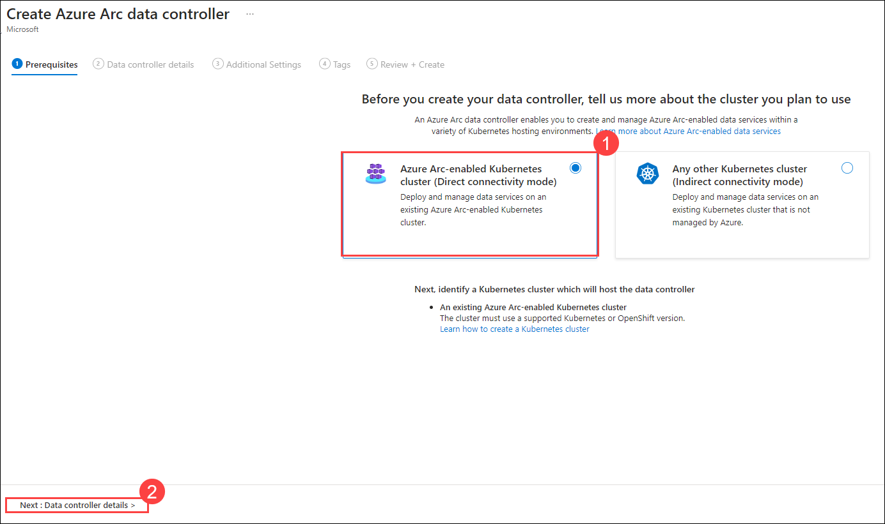
   
1. On the **Data controller details** blade enter the following details:

   * Select the available subscription from the dropdown.

   * Resource Group: Select **azure-arc (1)** from dropdown.

   * Data Controller Name: **arcdc-direct (2)**

   * Custom location: Select the available custom location from dropdown **(3)**.

        
      
1. Now scroll down and enter the below details in the remaining sections.
   
   Under Kubernetes configuration enter the details below:
   
   * Kubernetes configuration template: Select **azure-arc-aks-default-storage (1)** from dropdown.

   * Data Storage class: Leave default

   * Log Storage class: Leave the default

   * Service type: **Load balancer (2)**
   
   Under the Metrics and Logs Dashboard Credentials enter the below details.

   * Data controller login: **arcuser (3)**

   * Password: **Password.1!! (4)**

   * Confirm password: **Password.1!! (5)**

   After entering all the required details click on **Next: Additional settings** (6)

    

1. In the Additional settings blade, select the **LoganalyticsWS-Direct** **(1)** from the dropdown for the Log Analytics workspace. You will see that the Log Analytics workspace ID occurs by default. Enter the **Log Analytics primary key** **(2)** which you have copied to notepad earlier in task 2 and click on the **Next: Tags (3)** button.
   
    
    
1. Leave default on **Tags** blade and click on **Next: Review + Create** button. to start the Azure Arc data controller deployment.
  
    

1. On Review + Create Blade, you can check all the given details and click on the **Create** button to start the Azure Arc data controller deployment.

    > **Note:** The deployment of the Azure Arc data controller can take up to 10 minutes to complete.
  
    
   
1. Once the deployment is completed, click on the **Go to resource group** button.
 
    
   
1. From the **azure-arc** resource group, select **arcdc-direct** Azure Arc Data Controller from the resources.
 
      
   
## Task 5 : Monitor the creation of Azure Arc data controller on the cluster.
   
1. When the Azure portal deployment status shows the deployment was successful, you can check the status of the Arc data controller deployment on the cluster by running the below command on the PowerShell window:

   ```
   kubectl get datacontrollers -n azure-arc
   ```  
    > **Note**: The deployment of the Azure Arc data controller can take up to 10 minutes to complete.
  
    
   
1. Once the data controller state is changed to ready, proceed to the next steps. Please note that the data controller deployment can take 5-to-10 minutes to change it to ready.

1. On the Azure Ac data controller resource overview blade, explore the given information about the Namespace and Connection mode.
  
    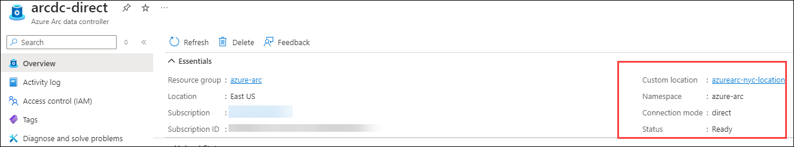


## Summary

In this exercise, we connected our cluster to the Azure Arc-enabled cluster and deployed a custom location and data controller with directly connected mode with the help of Azure portal and Azure CLI. Also, we have connected the Azure Arc Data Controller using Azure Data Studio.

### You have successfully completed the hands-on lab.

