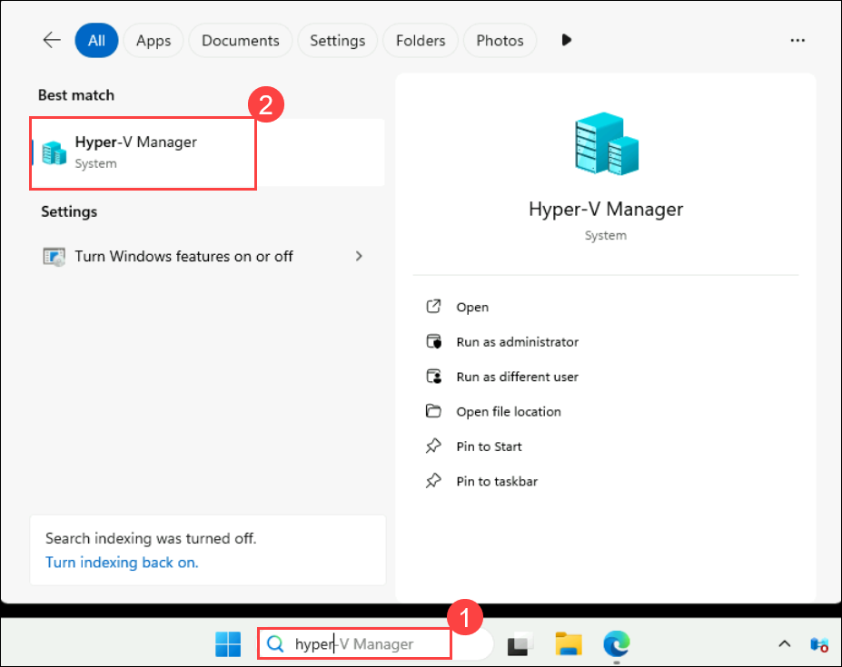
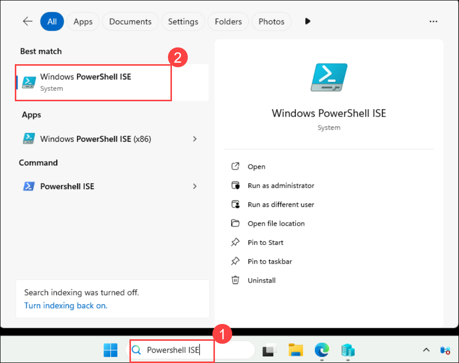

# Exercise 1: Preparing env with the prerequisites to deploy Azure Local 

### Overall Estimated Duration: 60 minutes

In this exercise, you'll be preparing the environment for deploying Azure Local, which involves installing and configuring the necessary operating system (e.g., Windows Server), along with any required drivers and software. Additionally, configuring networking components such as switches and routers to meet Azure Local's networking requirements is essential for successful deployment.

## Lab Objectives

You will be able to complete the following tasks:

- Task 1: Review the configured virtualized Azure Stack VMs
- Task 2: Onboard Azure Arc Machine to Azure and prepare to deploy Azure Local

## Task 1: Review the configured virtualized Azure Stack VMs 

1. In the LabVM, search for **Hyper-V Manager (1)** in the search box. Select **Hyper-V Manager (2)**.

   
    
2. From Hyper-V Manager, click on **HCIBOX-CLIENT** and review that the **AzSHOST1**, **AzSHOST2**, and **AzSMGMT** virtual machines are up and running, as shown in the below screenshot.

   

## Task 2: Onboard Azure Arc Machine to Azure and prepare to deploy Azure Local 

1. In the Windows search bar, type **PowerShell ISE** **(1)**, and select Windows **PowerShell ISE** **(2)** to open it from the Lab VM.

   

2. Run the below commands to onboard Azure Arc Machines to Azure:

   >**Note**: Script execution will take up to 30 to 45 minutes to update the pre-requisites and to onboard Azure Arc Machine to Azure.

    ```
       function Set-AzLocalDeployPrereqs {
       param (
           $LocalBoxConfig,
           [PSCredential]$localCred,
           [PSCredential]$domainCred
       )
       Invoke-Command -VMName $LocalBoxConfig.MgmtHostConfig.Hostname -Credential $localCred -ScriptBlock {
           $LocalBoxConfig = $using:LocalBoxConfig
           $localCred = $using:localcred
           $domainCred = $using:domainCred
           Invoke-Command -VMName $LocalBoxConfig.DCName -Credential $domainCred -ArgumentList $LocalBoxConfig -ScriptBlock {
               $LocalBoxConfig = $args[0]
               $domainCredNoDomain = new-object -typename System.Management.Automation.PSCredential `
                   -argumentlist ($LocalBoxConfig.LCMDeployUsername), (ConvertTo-SecureString $LocalBoxConfig.SDNAdminPassword -AsPlainText -Force)
   
               Install-PackageProvider -Name NuGet -MinimumVersion 2.8.5.201 -Force -Scope CurrentUser
               Install-Module AsHciADArtifactsPreCreationTool -Repository PSGallery -Force -Confirm:$false
               $domainName = $LocalBoxConfig.SDNDomainFQDN.Split('.')
               $ouName = "OU=$($LocalBoxConfig.LCMADOUName)"
               foreach ($name in $domainName) {
                   $ouName += ",DC=$name"
               }
               $nodes = @()
               foreach ($node in $LocalBoxConfig.NodeHostConfig) {
                   $nodes += $node.Hostname.ToString()
               }
               Add-KdsRootKey -EffectiveTime ((Get-Date).AddHours(-10))
               New-HciAdObjectsPreCreation -AzureStackLCMUserCredential $domainCredNoDomain -AsHciOUName $ouName
           }
       }
   
       foreach ($node in $LocalBoxConfig.NodeHostConfig) {
           Invoke-Command -VMName $node.Hostname -Credential $localCred -ArgumentList $env:subscriptionId, $env:spnTenantId, $env:spnClientID, $env:spnClientSecret, $env:resourceGroup, $env:azureLocation -ScriptBlock {
               $subId = $args[0]
               $tenantId = $args[1]
               $clientId = $args[2]
               $clientSecret = $args[3]
               $resourceGroup = $args[4]
               $location = $args[5]
   
               function ConvertFrom-SecureStringToPlainText {
                   param (
                       [Parameter(Mandatory = $true)]
                       [System.Security.SecureString]$SecureString
                   )
   
                   $Ptr = [System.Runtime.InteropServices.Marshal]::SecureStringToBSTR($SecureString)
                   try {
                       return [System.Runtime.InteropServices.Marshal]::PtrToStringBSTR($Ptr)
                   }
                   finally {
                       [System.Runtime.InteropServices.Marshal]::ZeroFreeBSTR($Ptr)
                   }
               } 

               $azureAppCred = (New-Object System.Management.Automation.PSCredential $clientId, (ConvertTo-SecureString -String $clientSecret -AsPlainText -Force))
               Connect-AzAccount -ServicePrincipal -SubscriptionId $subId -TenantId $tenantId -Credential $azureAppCred
               $armtoken = ConvertFrom-SecureStringToPlainText -SecureString ((Get-AzAccessToken -AsSecureString).Token)

               #Invoke the registration script.
               Invoke-AzStackHciArcInitialization -SubscriptionID $subId -ResourceGroup $resourceGroup -TenantID $tenantId -Region $location -Cloud "AzureCloud" -ArmAccessToken $armtoken -AccountID $clientId -ErrorAction Continue
       
           }
       }
   }


    $LocalBoxConfig = Import-PowerShellDataFile -Path $Env:LocalBoxConfigFile
    # Login to Azure to get access on the nodes
    $azureAppCred = (New-Object System.Management.Automation.PSCredential $env:spnClientID, (ConvertTo-SecureString -String $env:spnClientSecret -AsPlainText -Force))
    Connect-AzAccount -ServicePrincipal -SubscriptionId $env:subscriptionId -TenantId $env:spnTenantId -Credential $azureAppCred

   $tags = Get-AzResourceGroup -Name $env:resourceGroup | Select-Object -ExpandProperty Tags
   
   if ($null -ne $tags) {
       $tags['DeploymentProgress'] = $DeploymentProgressString
   } else {
       $tags = @{'DeploymentProgress' = $DeploymentProgressString }
   }
   
   $null = Set-AzResourceGroup -ResourceGroupName $env:resourceGroup -Tag $tags
   $null = Set-AzResource -ResourceName $env:computername -ResourceGroupName $env:resourceGroup -ResourceType 'microsoft.compute/virtualmachines' -Tag $tags -Force
   
   Invoke-AzureEdgeBootstrap -LocalBoxConfig $LocalBoxConfig -localCred $localCred
   
   Set-AzLocalDeployPrereqs -LocalBoxConfig $LocalBoxConfig -localCred $localCred -domainCred $domainCred
    ```

3. Navigate to the Azure portal and verify the Azure Arc Machines onboarded to Azure, named **AzSHOST1** and **AzSHOST2**.

    >**Note**: If you see that only one Azure Arc machine got onboarded, please re-perform the previous step to complete the onboarding. 

   

## Summary

In this exercise, reviewed the configured virtualized Azure Stack VMs and onboard Azure Arc Machine to Azure and prepare to deploy Azure Local.

### You have successfully completed the lab. Click on Next >> to proceed with next exercise.
