# Exercise 2: Deploying Azure Local in Azure Portal

### Estimated Duration: 180 Minutes

In this exercise, you will be deploying an Azure Local solution using a generated ARM template. You can deploy it either through the Azure portal by uploading the template and specifying deployment parameters or using PowerShell for automated deployment, offering flexibility and control over the deployment process. Here, you will be deploying Azure Local using PowerShell commands.

## Lab Objectives

You will be able to complete the following tasks:

- Task 1: Create and review the generated ARM template
- Task 2: Validate and deploy the Azure Local using PowerShell


## Task 1: Review the already generated ARM template

In this task, you will review the pre-generated ARM template and parameter files for Azure Local in VS Code, and assign the Azure Arc permission to the Azure Local resource provider.

1. In the Localbox-Client VM searchbar, type **VS Code (1)**, then click on **Visual Studio Code (2)** from the results.

    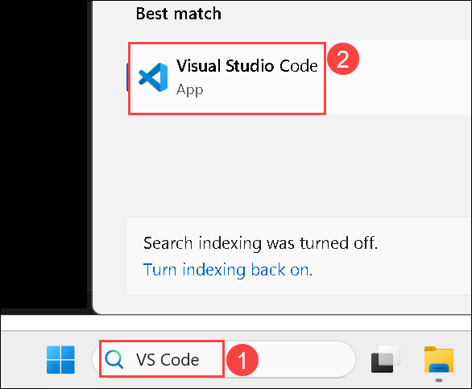

1. Click on **File (1)** from the top left corner, from the list select **Open Folder... (2)**.

    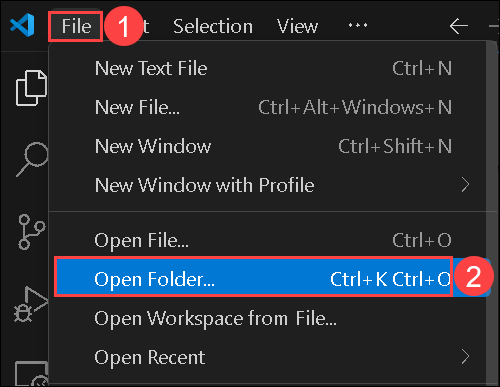

1. On the Open Folder window, navigate to **C:\ (1)** path, select **LocalBox (2)** folder, then click on **Open Folder (3)**.

    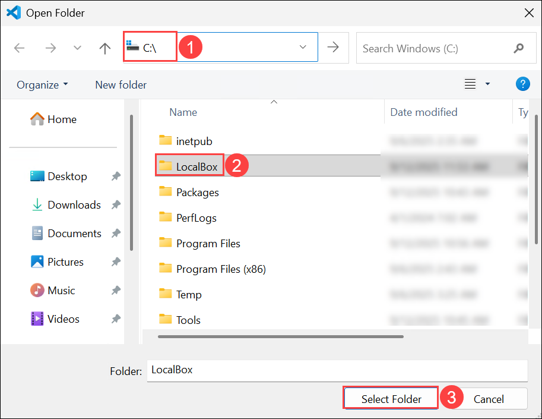

1. If **Do you trust the authors of the files in this folder?** option is prompted, click on **Yes, I trust the authors**.

1. Navigate to the **Azure portal**, in search bar type **Subscriptions (1)** and select **Subscriptions (2)** under the services. 

    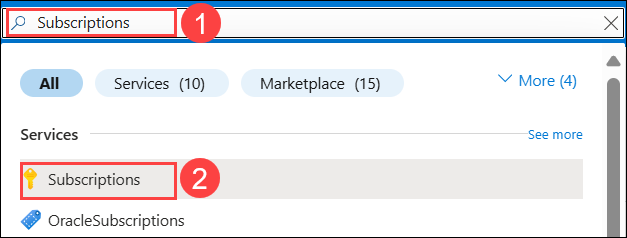

1. Select the **available** subscription.

    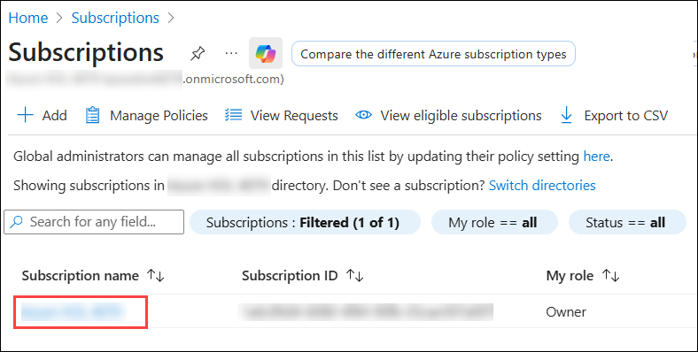

1. From the left navigation pane, select **Resource providers (1)** under Settings.

1. In the search bar of the Resource Providers page, search for **Hybrid (2)**, select **Microsoft.HybridCloud (3)**, then click on **Register (4).**

    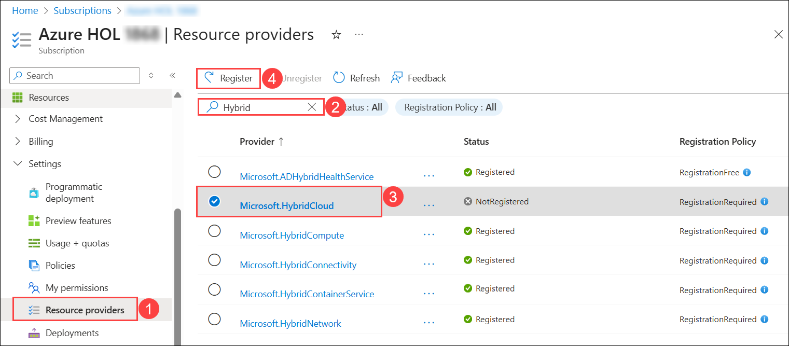

1. Similarly, on the Resource Providers page, search for **Hybrid**, select **Microsoft.HybridContainerService**, then click on **Register.**

    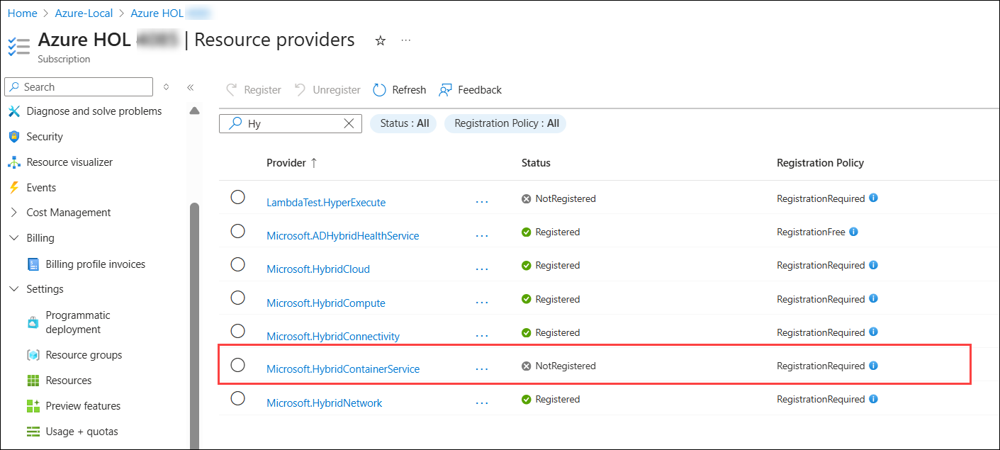     

1. In the **Azure portal** search bar, type **Microsoft Entra ID (1)** and select **Microsoft Entra ID (2)** under the services. 

    

1. On the Microsoft Entra ID page, from the left navigation pane, select **Enterprise applications** under Manage.

    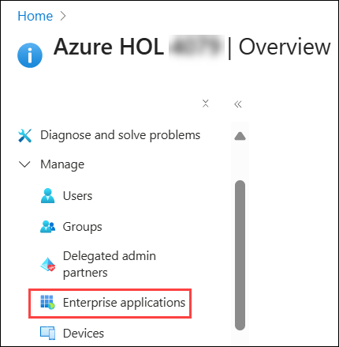

1. On the **Entrprise applications | All applications** page, click on **X** to clear the filter **Application type == Enterprise Applications**.

    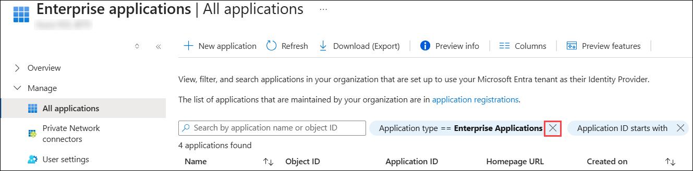

1. On the **Entrprise applications | All applications** page, search for **HCI (1)**, then select **Microsoft.AzureStackHCI Resource Provider (2)**.

    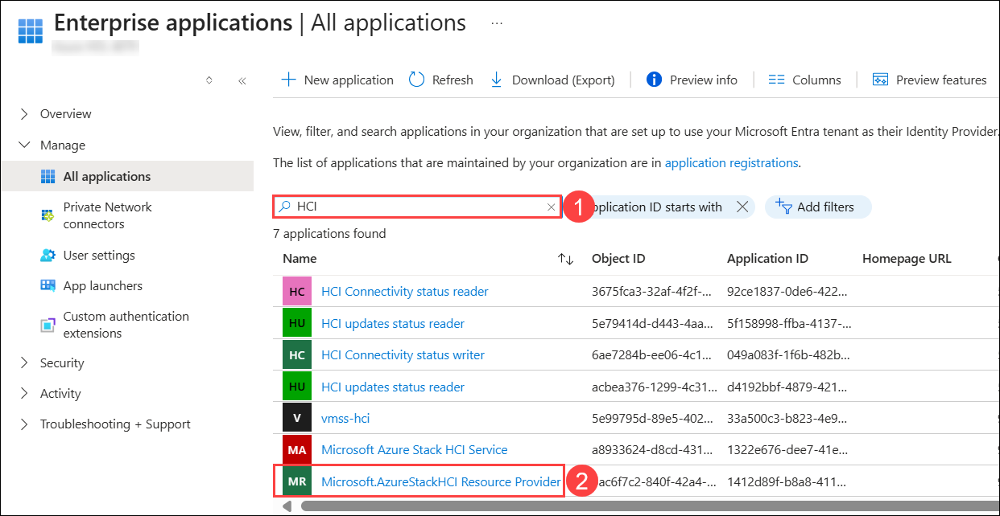

1. On **Microsoft.AzureStackHCI Resource Provider | Overview** page, click on the **copy icon** to copy the **Object ID** and  paste it into Notepad, as you need this in further steps.

    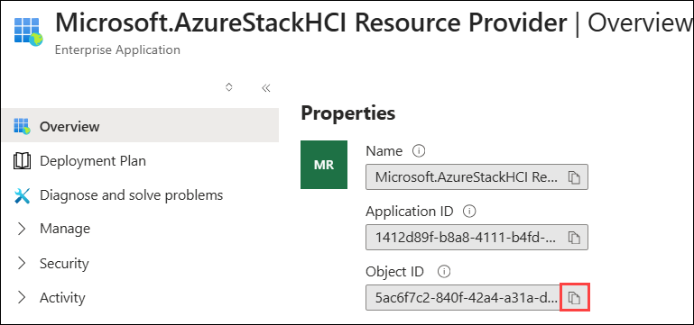

1. Open and review the **azlocal.json** and **azlocal.parameters.json files** in **VSCode**. Verify that the **azlocal.parameters.json file** looks correct without **"-staging"** placeholder parameter values. This has already been generated with the script available in the Localbox folder.

     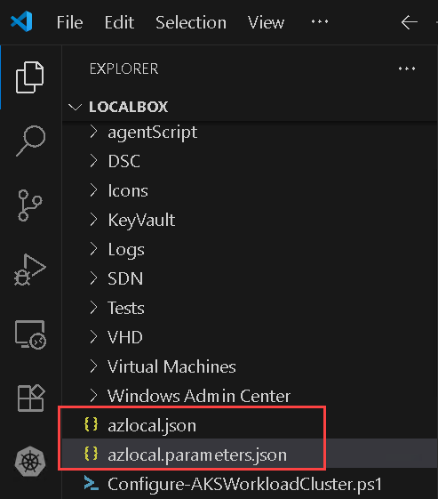

1. Open **azlocal.parameters.json (1)** file, scroll down to see **hciResourceProviderObjectID**, paste the Object ID in **value (2)** that you copied in Step 11 as shown below.

    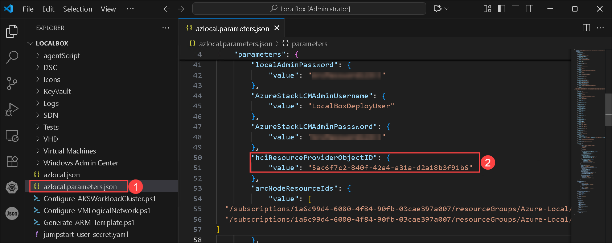


1. Press **Ctrl + S** to save the file.

    
## Task 2: Validate and deploy the Azure Local using PowerShell

In this task, you will validate and deploy the Azure Local cluster using PowerShell with the pre-configured ARM template and parameter files.

1. Open PowerShell ISE window and run the below command to validate your Azure Local deployment and cluster.

   ```
   $TemplateFile = Join-Path -Path $env:LocalBoxDir -ChildPath "azlocal.json"
   $TemplateParameterFile = Join-Path -Path $env:LocalBoxDir -ChildPath "azlocal.parameters.json"
    
   New-AzResourceGroupDeployment -Name 'localcluster-validate' -ResourceGroupName $env:resourceGroup -TemplateFile $TemplateFile -TemplateParameterFile $TemplateParameterFile -OutVariable ClusterValidationDeployment -ErrorAction Stop
    
   ```

1. The above command will take approximately 45 minutes to get your deployment validated and show you the Azure Local cluster on the Azure Portal.

1. You can navigate to the Azure Portal and see a new Azure Local resource created in your resource group.
   

1. Once the validation is completed, run the command below to start the creation of Azure Local. This command will take approximately 3 hrs to deploy your cluster. 

   ```
   New-AzResourceGroupDeployment -Name 'localcluster-deploy' -ResourceGroupName $env:resourceGroup -TemplateFile $TemplateFile -deploymentMode "Deploy" -TemplateParameterFile $TemplateParameterFile -OutVariable ClusterDeployment -ErrorAction Stop
    
   ```

11. Once the deployment starts, you can navigate to the Azure Portal, select your Azure Local resource, and select the  **Deployments (1)** under Settings to see your **deployment status (3)**.
   
12. Azure Local may take 3 to 5 hours to get deployed. If you navigate elsewhere in the Azure Portal, you can return to monitor progress on the Deployments tab of the cluster resource. Click **Refresh (2)** to get the latest status on deployment.

     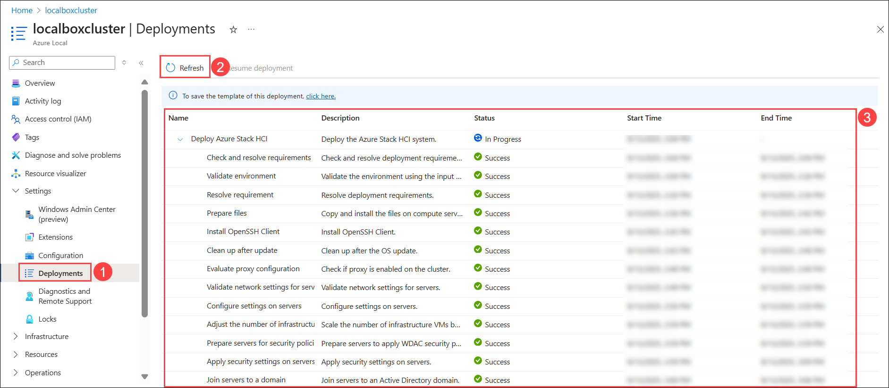

## Summary

In this exercise, you assigned Azure Arc permission to the Azure Local resource provider, created and reviewed the generated ARM template, and validated and deployed the Azure Local cluster using the Azure portal.

### You have successfully completed the lab. Click on Next >> to proceed with the next exercise.


