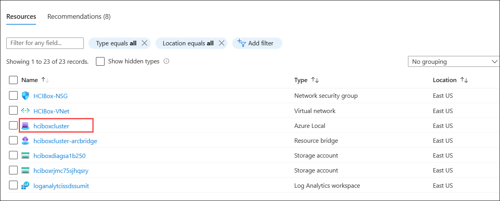
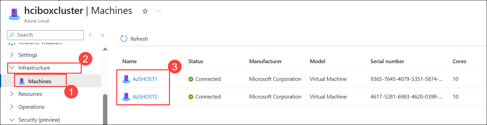
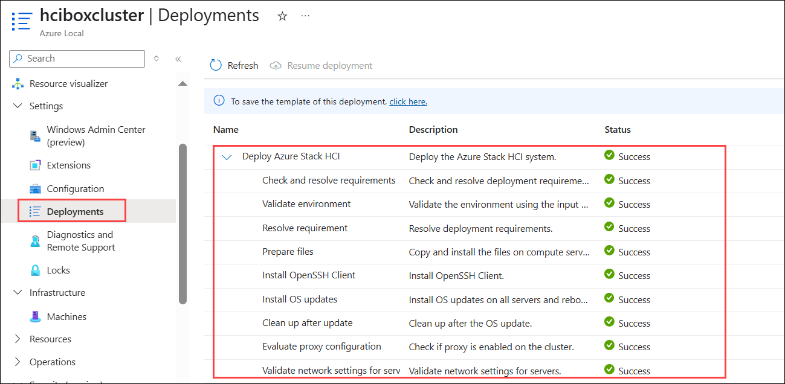

# Exercise 3: Verify the JumpStart HCI Box deployment

### Estimated Duration: 30 minutes

In this exercise, you'll be verifying and confirming the successful deployment and configuration of Azure Local in the Azure Portal.

## Lab Objectives

You will be able to complete the following task:

- Task 1: Verify the Azure Local deployment in Azure and its configuration

## Task 1: Verify the Azure Local deployment in Azure and its configuration 

1. From the Azure portal, open a resource group named **AzureLocal**.

2. Select an Azure Local resource named **hciboxcluster**.

   

1. Go to **Infrastructure (2)** in the left-hand menu, then select **Machines (1)** and verify that the Azure Arc machines are connected to **hciboxcluster (3)**.

   

4. To verify Azure Local cluster deployment, click on **Deployments** under **Settings** and verify that **Deploy Local** is completed with status **Success**.

   

## Summary

In this exercise, you verified the Azure Local deployment in Azure and its configuration.

### You have successfully completed the lab
