# Exercise 4: Managing AKS on Azure Local 

### Estimated Duration: 60 minutes

In this exercise, you'll be focusing on managing Azure Kubernetes Service (AKS) on Azure Local, which involves creating a logical network specifically tailored for AKS on Azure Local. It also covers setting up an Azure Active Directory (AAD) tenant group for authentication purposes. The process involves deploying AKS on Azure Local via the Azure Portal and establishing the necessary connections to access the AKS deployment. This hands-on lab demonstrates the setup and configuration steps required for deploying and managing AKS in an Azure Local environment.

## Lab Objectives

You will be able to complete the following tasks:

- Task 1: Create a Logical Network for Azure Local for AKS
- Task 2: Create an Entra Group for the authentication of AKS
- Task 3: Create AKS on Azure Local using Azure Portal
- Task 4: Connecting to the Azure Local AKS

## Task 1: Create a Logical Network for Azure Local for AKS

1. On the **Azure portal**, in search bar type **Resource groups (1)** and select **Resource groups (2)** under the services. 

   

2. From the Resource groups pane, click on **Azure-Local** resource group and verify the resources present in it.

   

3. In the  **Azure-Local** resource group in the search bar search for **localboxcluster** **(1)** and select **localboxcluster** **(2)** Azure Local.

   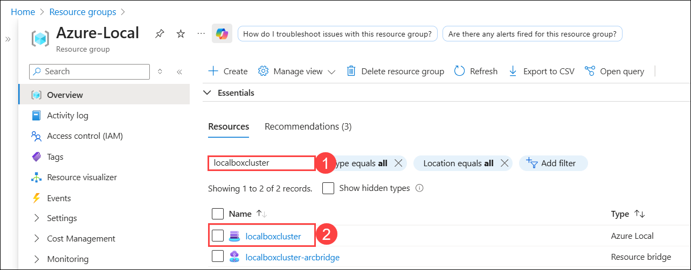

4. In the **localboxcluster** Azure Local, from the left menu select **Logical networks** **(1)** under Resources, and click on **+ Create logical network** **(2)**.

   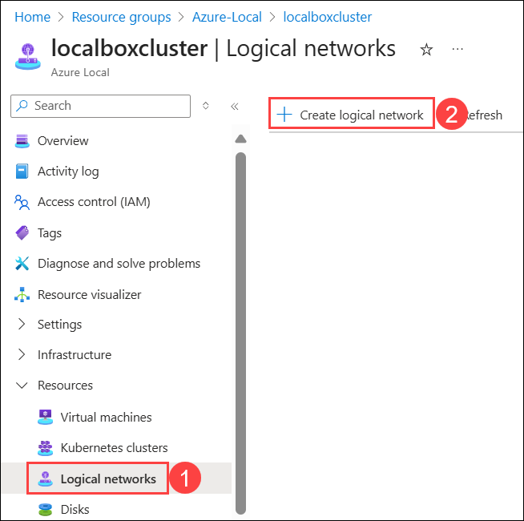

5. In the **Create logical network** tab, under Basic, fill in the following details and click on **Next: Network Configuration** **(5)**.

    - Subscription: Default subscription **(1)**
    - Resource group : **Azure-Local** **(2)**
    - Logical network name: **localbox-aks-lnet-vlan110** **(3)**
    - Virtual switch name: **ConvergedSwitch(compute_management_storage)** **(4)**

      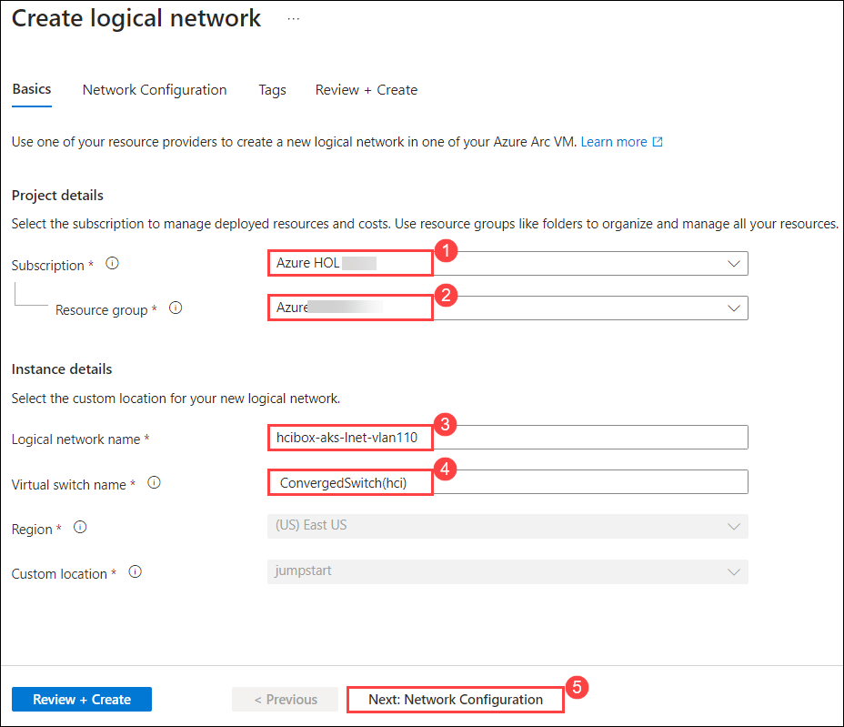

6. In the **Network Configuation** tab, under the fallowing deatils and click on **Next: Tags** **(9)**.

    | **Variables**                | **Values**                                                    |
    | ---------------------------- |---------------------------------------------------------------|
    | IP address assignment | **Static** **(1)** |
    | IPv4 address space    | **10.10.0.0** **(2)** from the drop down  address prefix select **\24** **(3)** |
    | IP pools              | Enter Start IP **10.10.0.101** **(4)** and End IP **10.10.0.199** **(5)** |
    | Default Gateway       | Enter Default Gateway address as **10.10.0.1** **(6)** |
    | DNS Servers           | Enter DNS Servers **192.168.1.254** **(7)** |
    | VLAN ID               | Enter **110** **(8)** | 

   

7. In the **Tag** tab, leave it as default and click **Next: Review + Create**.

8. In the **Review + Create** tab, click on on **Create** button.

   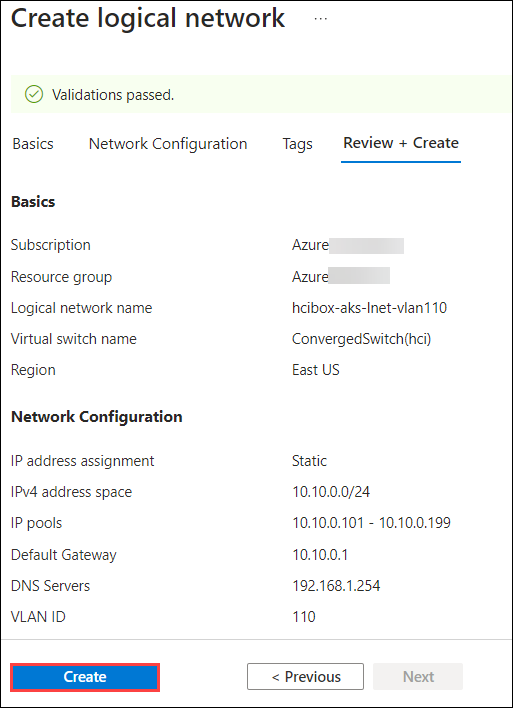

## Task 2: Create an Entra Group for authentication of AKS

1. In the Azure portal, click on the search blade at the top and search for **Microsoft Entra ID (1)** and select **Microsoft Entra ID (2)**.

    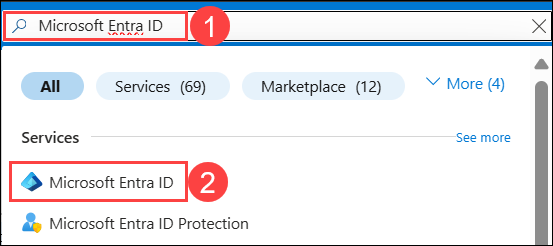

10. On the **Microsoft Entra ID** Overview page, click on **+ Add (1)**, then select **Group (2)** from the list. 

    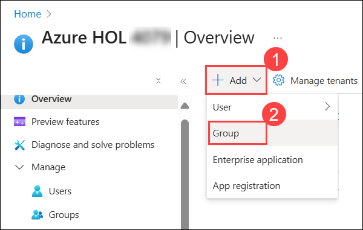

12. In the **New Group** tab, enter the **Group name** as **aks-auth** **(1)**, click on the **No Owner Selected** **(2)** under **Owners**, from the search **(3)** and select **(4)** for user **ODL_User <inject key="DeploymentID"></inject>**, and click on **Select** **(5)**.

    

13. In the **New Group** tab, click on **Create** button.

    

## Task 3: Create AKS on Azure Local using Azure Portal

1. In the Azure portal, click on the search blade at the top and search for **Kubernetes services (1)** and select **Kubernetes services (2)**.

    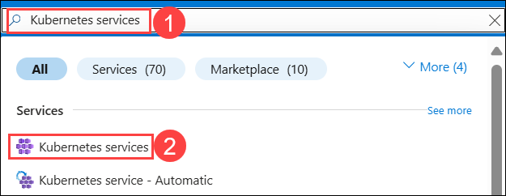

1. In the **Kubernetes services** tab, click on **+ Create** **(1)** and from the drop-down select **Create a Kubernetes cluster with Azure Arc** **(2)**.

    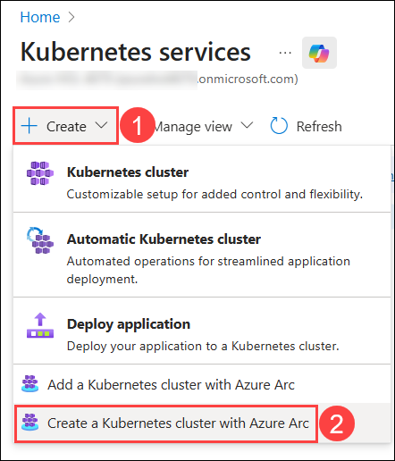

1. In the **Create a Kubernetes cluster with Azure Arc​** tab, fill in the following details in the Basic section and click on **Next: Node Pool** **(7)**.

   | **Variables**                | **Values**                                                    |
   | ---------------------------- |---------------------------------------------------------------|
   | Subscription | Default subscription **(1)** |
   | Resource group | From the drop-down Select **Azure-Local** **(2)**  |
   | Kubernetes cluster name | Enter the cluster name as **localaks** **(3)** |
   | Custom location | From the drop-down Select **jumpstart(EastUS)** **(4)** |
   | Node size | From the drop down select **Standard_A2_v2** **(5)** |
   | Key pair name | Enter the Key pair name as **localaks** **(6)** |

   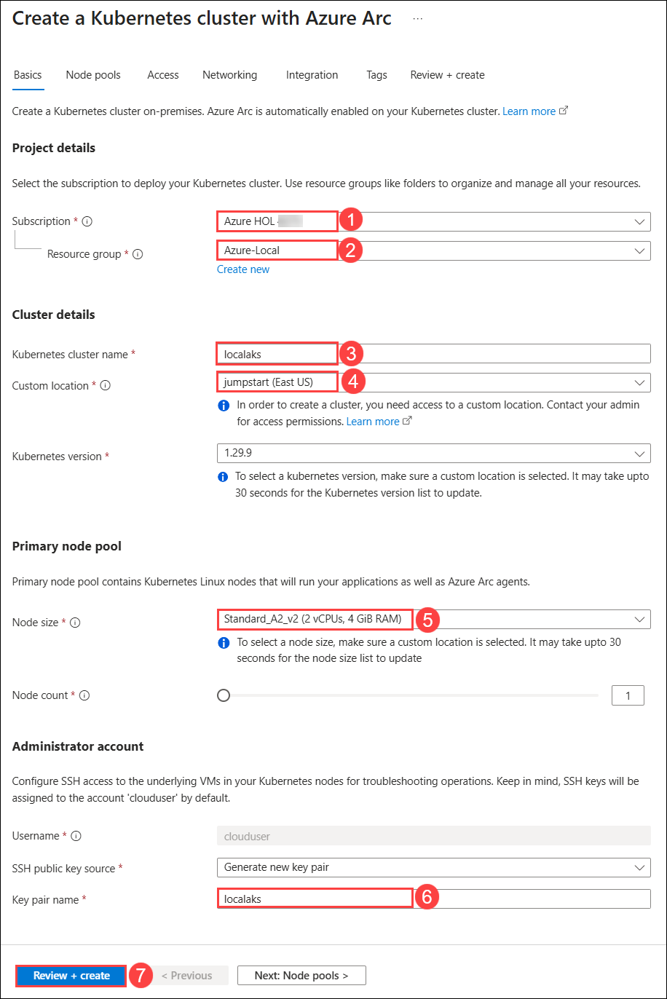

1. In the **Node Pool** tab, leave it default and click in **Next: Access**.

1. In the **Access** tab, select **Authentication and Authorization** method as **Microsoft Entra authentication with Kubernetes RBAC** **(1)**, and Click on **Choose Microsoft Entra group** **(2)**. 

   

1. In the **Choose Microsoft Entra group for cluster-admin ClusterRoleBinding** pop-up select **aks-auth (1)** group and click on **Select (2)**.

   

2. In the **Access** tab, click on **Next: Networking**.

2. In the **Networking** tab, select **Local network** as **localbox-aks-lnet-vlan110** **(1)**, enter **Control plane IP** as **10.10.0.5** **(2)**, and click on **Review + Create** **(3)** .

   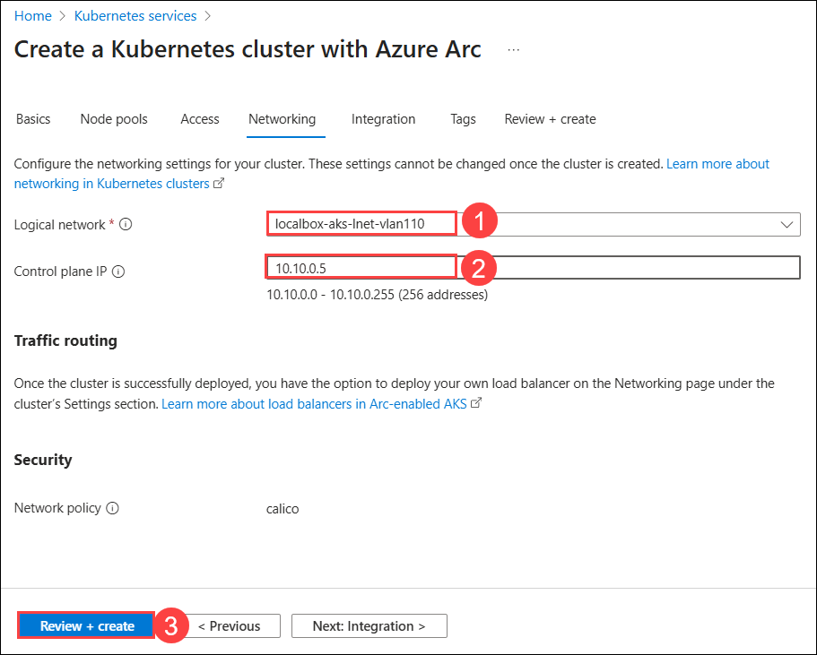

2. In the **Review + Create** tab, click on **Review**.

   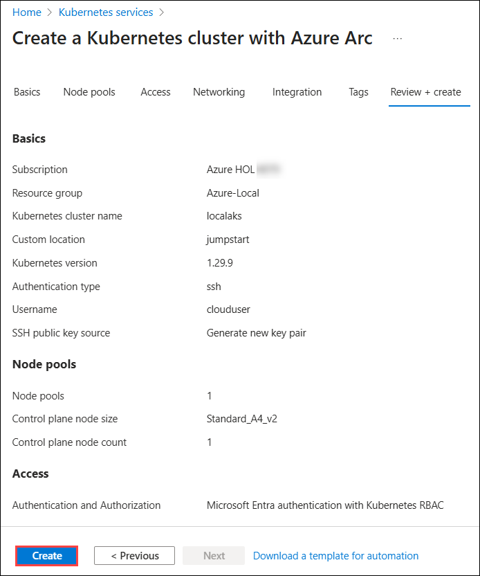

2. Click on the AKS cluster to view details such as the Kubernetes version. "Status" may show connecting for some time while the cluster fully connects to Azure.

     
    
## Task 4: Connecting to the Azure Local AKS

1. From your jumpVM, open PowerShell and run the following command, using the name of your localBox resource group.

   >Note: PowerShell ISE will not work as it may need some inputs while executing the command. 

    ```
    az extension add -n connectedk8s
    az extension update --name connectedk8s
    az connectedk8s proxy -n localaks -g azure-local
    ```
     
   
   >Note: If you get any option to install any extension, please enter **Y**.    

3. From JumpVM, open a new PowerShell session, and then in the new shell, you will have kubectl access to your cluster. Try running some kubectl commands for yourself.

    

## Summary

In this exercise, you created a Logical Network for Azure Local for AKS, created an Entra Group for authentication of AKS, created AKS on Azure Local using Azure Portal, and connected to the Azure Local AKS.

### You have successfully completed the lab. Click on Next >> to proceed with the next exercise.

