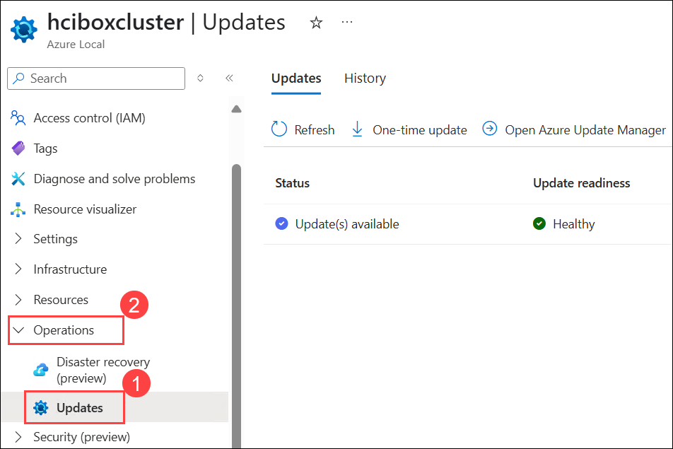
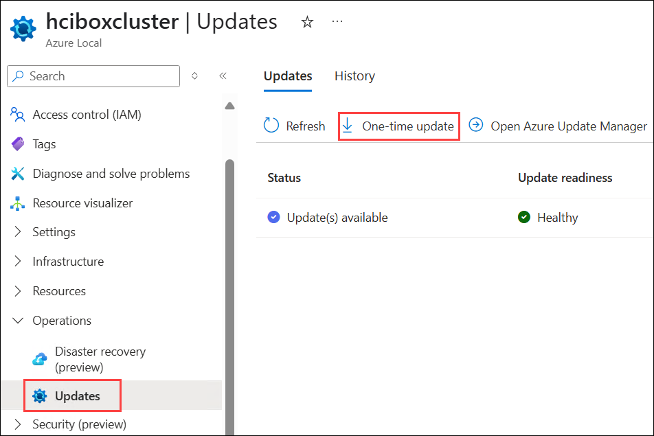
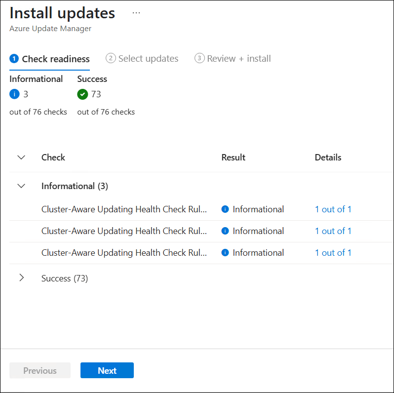
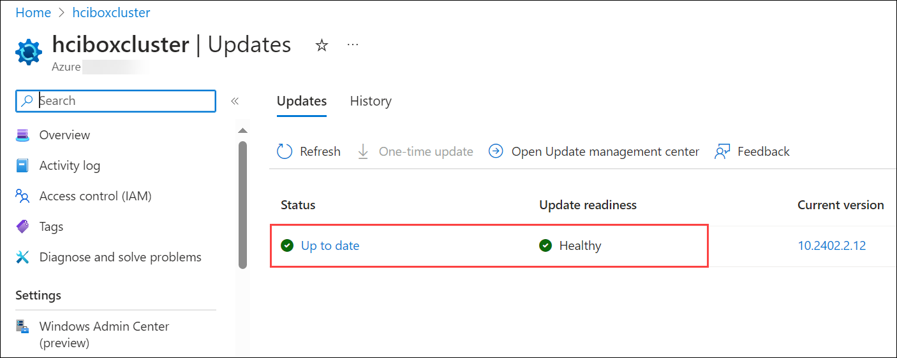

# Exercise 5: Azure Local Update management using Azure Portal  

### Estimated Duration: 30 minutes

In this exercise, you'll be checking for updates in Azure Local via the Azure Portal involves leveraging Azure Arc for centralized management and update assessment. Administrators can deploy updates seamlessly across clusters, scheduling and monitoring the process for minimal disruption and optimal infrastructure performance. This integration streamlines hybrid cloud operations, enhancing agility and security across on-premises and Azure environments.

## Lab Objectives

You will be able to complete the following task:

- Task 1: Update Azure Local

## Task 1: Update Azure Local  

1. Navigate to Azure Local resource named **hciboxcluster** from Azure-Local resource group.

2. In the Azure Local page, select **Updates (1)** under **Operations (2)** from left menu.

   

3. From Updates pane, click on **One-time update**.

   

4. In the Install updates pane from Azure Update manager, verify the available updates and click on **Next**.

   
  
5. Select the available updates to install and click on **Next**.

   

6. From Review + install pane, review the selected updates and click on **Install**.

   

7. You will see a notification that **Installation started on 1 Azure Local systems**. Also, you will be able to see the In-progress status from Updates pane.

   

8. Updating the Azure Local Cluster will take around 2 Hours. Once it's updated successfully, you will be able to see the status as **Up to date** and the update readiness as **Healthy** as shown in the below screenshot.

   

## Summary

In this exercise, you updated the **hciboxcluster** Azure Local resource.

### You have successfully completed the lab
