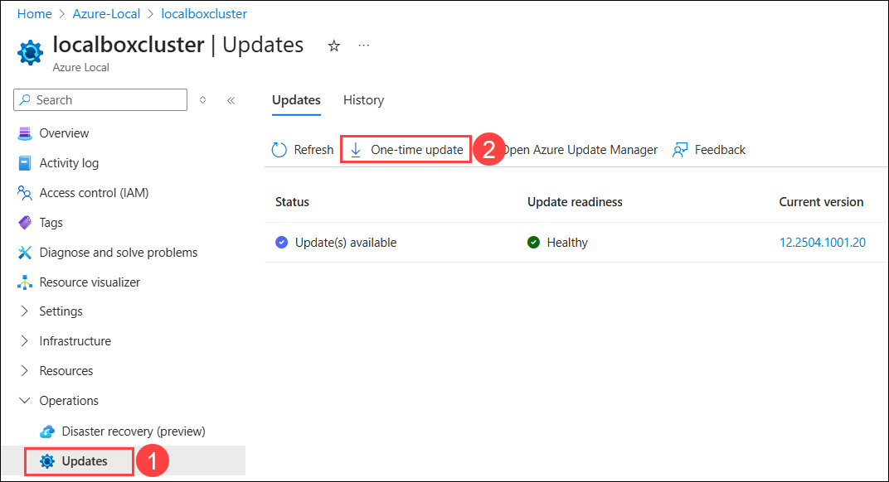
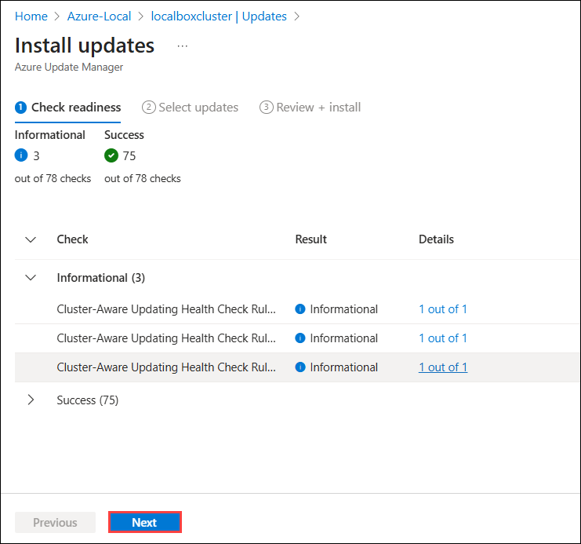
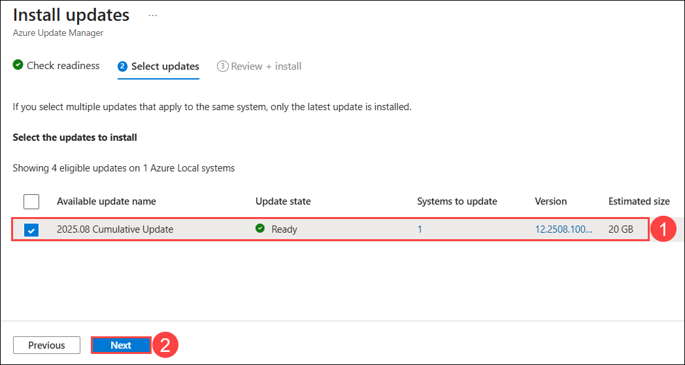
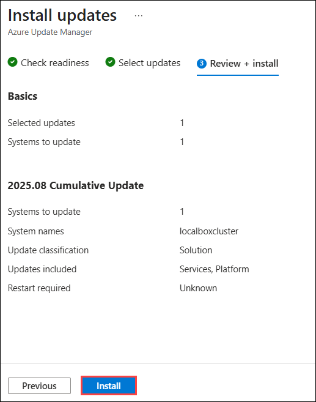
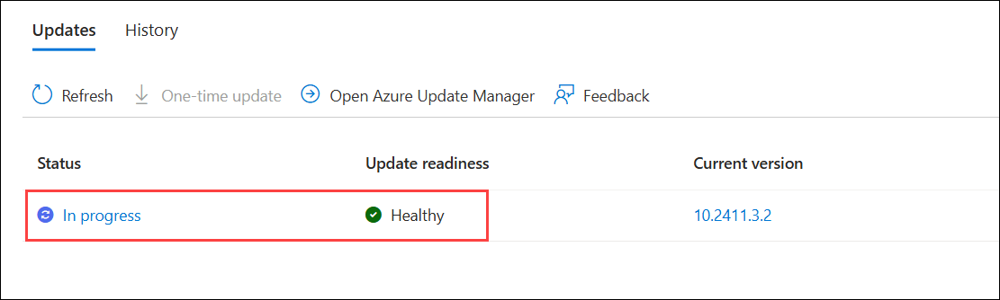
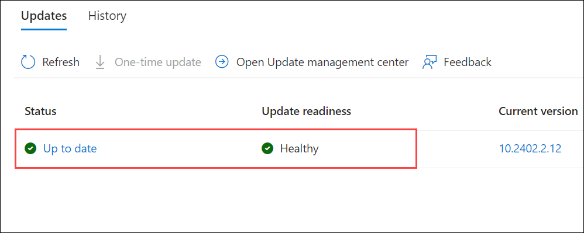

# Exercise 5: Azure Local Update management using Azure Portal  

### Estimated Duration: 30 Minutes

In this exercise, you'll be checking for updates in Azure Local via the Azure Portal involves leveraging Azure Arc for centralized management and update assessment. Administrators can deploy updates seamlessly across clusters, scheduling and monitoring the process for minimal disruption and optimal infrastructure performance. This integration streamlines hybrid cloud operations, enhancing agility and security across on-premises and Azure environments.

## Lab Objectives

You will be able to complete the following task:

- Task 1: Update Azure Local

## Task 1: Update Azure Local  

In this task, you wil perform updates on the localboxcluster Azure Local resource using the Azure portal. The process involves verifying resources, selecting updates, and installing them via the Update Manager.

1. On the **Azure portal**, in search bar type **Resource groups (1)** and select **Resource groups (2)** under the services. 

   

2. From the Resource groups pane, click on **Azure-Local** resource group and verify the resources present in it.

   

3. In the  **Azure-Local** resource group in the search bar search for **localboxcluster** **(1)** and select **localboxcluster** **(2)** Azure Local.

   

2. In the Azure Local page, select **Updates (1)** under **Operations** from left menu.

3. From the Updates pane, click on **One-time update (2)**.

   

4. In the Install updates pane from Azure Update manager, verify the available updates and click on **Next**.

   
  
5. Select the available updates to install and click on **Next**.

   

6. From the Review + install pane, review the selected updates and click on **Install**.

   

7. You will see a notification that **Installation started on 1 Azure Local systems**. Also, you will be able to see the In-progress status from the Updates pane.

   

8. Updating the Azure Local Cluster will take around 2 Hours. Once it's updated successfully, you will be able to see the status as **Up to date** and the update readiness as **Healthy** as shown in the screenshot below.

   

## Summary

In this exercise, you successfully updated the **localboxcluster** Azure Local cluster through the Azure portal. The update process ensured the system was brought to the latest version, and the final status showed Up to date with Healthy readiness.

### You have successfully completed the lab!

By completing the **Hybrid Cloud Solution - Azure Local** Hands-On lab, you have successfully  gained practical experience with the key stages of working with **Azure Local** in a hybrid cloud setup. Beginning with the prerequisite environment configuration, you moved through deployment in the Azure portal, virtual machine provisioning, and container orchestration using **AKS on Azure Local**. Finally, you explored how to manage updates within Azure Local directly from the Azure portal. By completing all exercises, you now have a solid understanding of how Azure Local integrates with Azure services, supports VM and container workloads, and provides centralized management and update capabilities. This hands-on experience highlights how Azure Local extends the Azure control plane into on-premises or edge environments, enabling consistent hybrid cloud operations.

