# Hybrid Cloud Solution - Azure Local

### Overall Estimated Duration: 8 Hours

## Overview

LocalBox is a turnkey solution that provides a complete sandbox for exploring Azure Local capabilities and hybrid cloud integration in a virtualized environment. LocalBox is designed to be completely self-contained within a single Azure subscription and resource group, which will make it easy for a user to get hands-on with Azure Local and Azure Arc technology without the need for physical hardware.

Azure Local 23H2 is now generally available. 23H2 simplifies the configuration and deployment of Azure Local instances and related workloads, like VM management for VM self-service management in the Azure portal. localBox has also been updated and now offers Azure Local instances built on the new 23H2 OS, and prior Azure Local releases are no longer part of LocalBox.

## Azure Local capabilities available in LocalBox

### 2-node Azure Local instance

LocalBox automatically creates and configures a two-node Azure Local instance using nested virtualization with Hyper-V running on an Azure Virtual Machine. This Hyper-V host creates three guest virtual machines: two Azure Local machines (_AzLHOST1_, _AzLHOST2_), and one nested Hyper-V host (_AzLMGMT_). _AzLMGMT_ itself hosts two guest VMs: an [Active Directory domain controller](https://learn.microsoft.com/windows-server/identity/ad-ds/get-started/virtual-dc/active-directory-domain-services-overview), and a [Routing and Remote Access Server](https://learn.microsoft.com/windows-server/remote/remote-access/remote-access) acting as a virtual router.

### Virtual machine management

LocalBox comes with [guest VM management in Azure portal](https://learn.microsoft.com/azure/azure-local/manage/azure-arc-vm-management-overview). The LocalBox documentation will walk you through how to use this feature, including configuring VM images from the Azure marketplace and creating VMs on your instance.

### AKS enabled by Azure Arc on Azure Local

Azure Local includes [AKS enabled by Azure Arc](https://learn.microsoft.com/azure/aks/aksarc/aks-overview) as part of the default configuration. A user script is provided that can be used to create a workload instance.

## LocalBox Azure Consumption Costs

LocalBox resources incur Azure consumption charges based on the underlying services, such as compute, storage, networking, and other associated components. These costs may vary depending on the Azure region where LocalBox is deployed. To avoid unnecessary charges, it's important to monitor your LocalBox deployments and disable or delete resources when they are not in use. Please see the [Jumpstart LocalBox FAQ](../faq/) for more information on consumption costs.

## Objective

To create a flexible and cost-effective hybrid cloud environment that seamlessly integrates on-premises and cloud resources, enabling organizations to optimize performance, streamline management, and enhance scalability while ensuring security and compliance. This approach allows businesses to leverage existing investments, modernize applications, and improve disaster recovery and backup capabilities, ultimately driving innovation and agility in a rapidly evolving digital landscape.

- **Preparing the environment with the prerequisites to deploy Azure Local:** Ensure the infrastructure meets all requirements for a successful Azure Local deployment, enabling efficient resource utilization and performance.
  
- **Deploying JumpStart-LocalBox in Azure Portal:** Quickly provision a ready-to-use Azure Local environment using JumpStart-LocalBox for streamlined setup, accelerating time to value for cloud initiatives.

- **Verify the JumpStart Local Box deployment:** Confirm the successful deployment of the JumpStart Local Box to ensure readiness for subsequent configurations, minimizing potential issues during production rollout.
  
- **Azure Backup Server on Azure Local:** Implement Azure Backup Server to enhance data protection and recovery capabilities within Azure Local, ensuring business continuity and compliance with data retention policies.
  
- **Managing AKS on Azure Local:** Oversee and optimize Azure Kubernetes Service (AKS) deployments on Azure Local for efficient container orchestration, facilitating rapid application development and deployment.
  
- **Azure Local machines Provisioning:** Facilitate the rapid creation and deployment of virtual machines within the Azure Local environment, enhancing operational efficiency and resource allocation.
  
- **Azure Local Update management using Azure Portal:** Streamline the update management process for Azure Local through the Azure Portal for improved system reliability and security, ensuring the infrastructure is always up-to-date with the latest features and patches.

## Prerequisites

Participants should have:

- **Basic Cloud Knowledge:** Understanding of cloud computing concepts, including IaaS, PaaS, and SaaS.
- **Familiarity with Azure Services:** Basic knowledge of Azure services and the Azure Portal interface.
- **Networking Fundamentals:** Understanding of networking concepts, such as IP addressing, subnets, and routing, which are crucial for configuring hybrid environments.
- **Windows Server Knowledge:** Proficiency with Windows Server, including installation, configuration, and management, as Azure Local runs on Windows Server technology.
- **Virtualization Concepts:** Familiarity with virtualization technologies, including Hyper-V, as Azure Local utilizes Hyper-Converged Infrastructure.
- **PowerShell Basics:** Basic knowledge of PowerShell for scripting and automation tasks in Azure and Azure Local environments.
- **Storage Fundamentals:** Understanding of storage technologies and concepts, including SAN, NAS, and local storage, which are relevant to Azure local setups.
- **Backup and Disaster Recovery Concepts:** Awareness of backup strategies and disaster recovery planning to effectively implement Azure Backup Server.
- **Kubernetes Basics:** Familiarity with containerization and Kubernetes concepts, especially for managing AKS on Azure Local.

## Architechture

The architecture of a Hybrid Cloud Solution using Azure Local integrates on-premises infrastructure with Azure services, creating a cohesive and flexible environment. At the core, Azure Local utilizes a hyper-converged infrastructure powered by Windows Server and Hyper-V, enabling efficient virtualization and storage management through Storage Spaces Direct. This on-premises setup connects seamlessly to Azure services via the Azure Portal, allowing organizations to leverage cloud capabilities such as Azure Backup, Azure Kubernetes Service (AKS), and Azure Site Recovery. Management and monitoring are facilitated through Windows Admin Center, providing a unified interface for performance tracking and configuration. The architecture supports a hybrid model that ensures data locality, optimized workload placement, and enhanced disaster recovery, empowering businesses to scale their operations while maintaining control over their data and resources.

## Architecture Diagram

## Explanation of Components

The architecture for this lab involves the following key components:

- **Azure Local:** The primary infrastructure service providing a hyper-converged environment that integrates with Azure.
- **Azure Backup:** A service that provides backup and disaster recovery capabilities for on-premises and cloud-based resources.
- **Azure Kubernetes Service (AKS):** A managed container orchestration service that can run on Azure Local for deploying and managing containerized applications.
- **Azure Monitor:** A service for monitoring application performance and infrastructure health, offering insights into the operation of Azure Local environments.
- **Azure Site Recovery:** A disaster recovery service that can be used to replicate on-premises workloads to Azure for business continuity.
- **Windows Server:** The underlying operating system that runs Azure Local, providing the necessary virtualization capabilities.
- **Hyper-V:** The virtualization technology used in Azure Local to host virtual machines.
- **Windows Admin Center:** A management tool for configuring and monitoring the Azure Local cluster and its resources.

## Getting Started with the Lab
 
Welcome to your Hybrid Cloud Solution - Azure Local Workshop! We've prepared a seamless environment for you to explore and learn about Azure services. Let's begin by making the most of this experience:
 
## Accessing Your Lab Environment

Once you're ready to dive in, your virtual machine and lab guide will be right at your fingertips within your web browser.

### Virtual Machine & Lab Guide
 
Your virtual machine is your workhorse throughout the workshop. The lab guide is your roadmap to success.

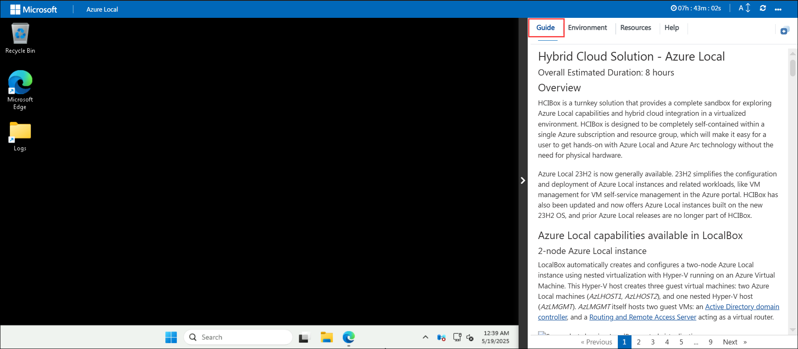
 
### Exploring Your Lab Resources
 
To get a better understanding of your lab resources and credentials, navigate to the **Environment** tab.
 
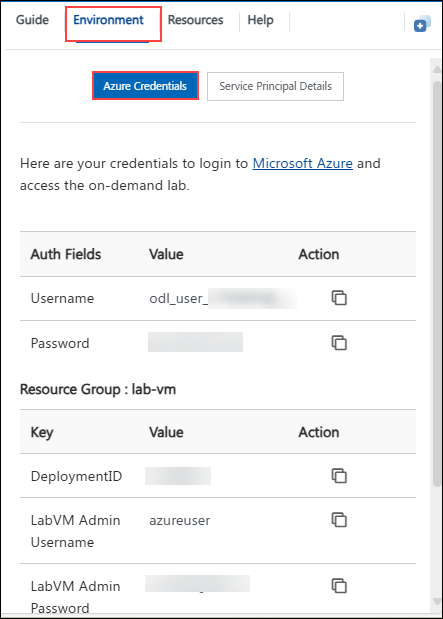
 
### Utilizing the Split Window Feature
 
For convenience, you can open the lab guide in a separate window by selecting the **Split Window** button from the Top right corner.
 
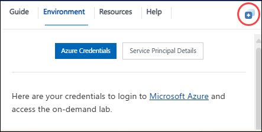
 
### Managing Your Virtual Machine
 
Feel free to **start, restart or stop (2)** your virtual machine as needed from the **Resources (1)** tab. Your experience is in your hands!

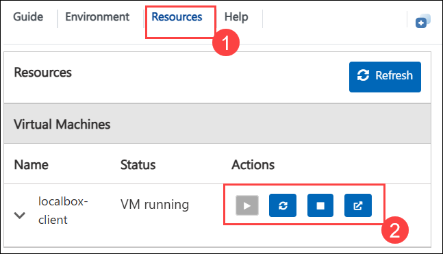

## Lab Guide Zoom In/Zoom Out

To adjust the zoom level for the environment page, click the **A↕ : 100%** icon located next to the timer in the lab environment.

## Login to the Azure portal

1. In the **LocalBox-Client** virtual machine, double-click on the Microsoft Edge browser shortcut that is provided on the desktop.
  
   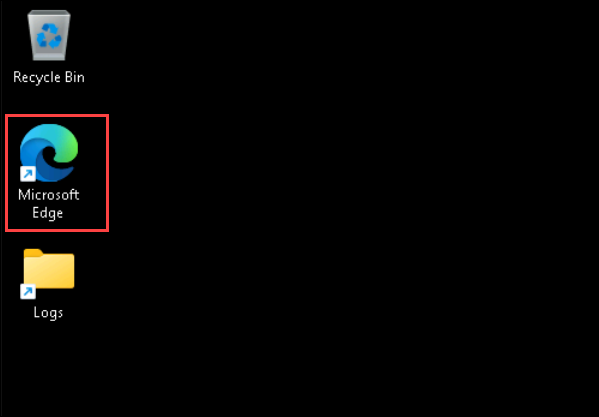
    
1. Navigate to Azure Portal using the URL provided here: `https://portal.azure.com/`. On the **Sign into Microsoft Azure** tab, you will see the login prompt. Enter the following **Email/Username**, and then click on **Next (2)**. 
      
   * Email/Username: **<inject key="AzureAdUserEmail"></inject> (1)**
  
   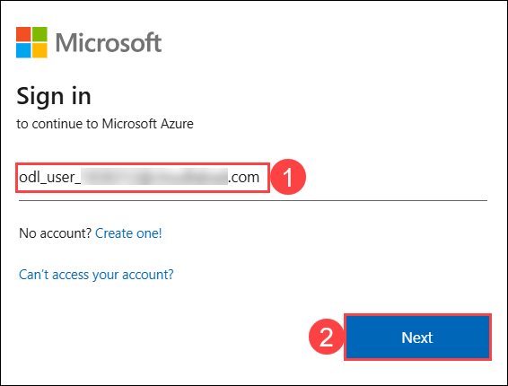
   
1. Now, enter the **password** that you have already received for the above account, then click on **Sign in (2).**
      
   * Password: **<inject key="AzureAdUserPassword"></inject> (1)**
  
      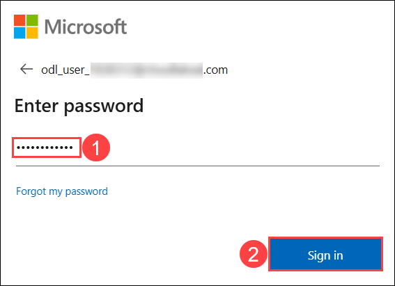

1. On the **Action Required** pop-up click on **Ask later**.

   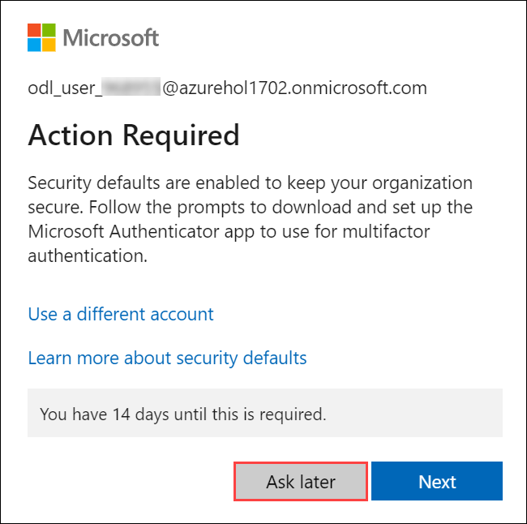

   > **Note**: If prompted with MFA, please follow the steps highlighted under - [Steps to Proceed with MFA Setup if Ask Later Option is Not Visible](#steps-to-proceed-with-mfa-setup-if-ask-later-option-is-not-visible)     

1. If you see the pop-up **Stay signed in?** Click **No**.

   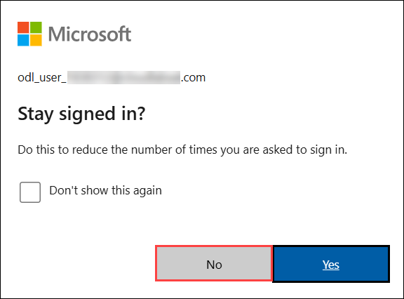

1. If you see the pop-up, **You have free Azure Advisor recommendations!** close the window to continue the lab.

1. If the **Welcome to Microsoft Azure** popup window appears, click **Cancel** to skip the tour.

1. On the **Azure portal**, in search bar type **Resource groups (1)** and select **Resource groups (2)** under the services. 

   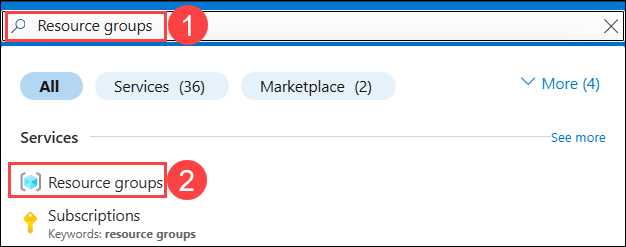

1. From the **Resource** groups pane, click on the **Azure-Local** resource group and verify the resources present in it.

   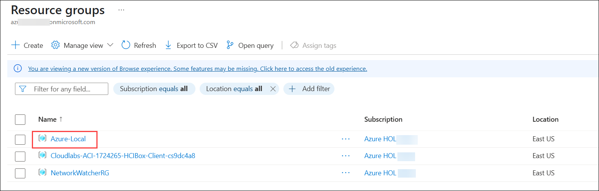

## Steps to Proceed with MFA Setup if Ask Later Option is Not Visible

   > **Note:** Continue with the exercises if MFA is already enabled or the option is unavailable.

1. At the **"More information required"** prompt, select **Next**.

1. On the **"Keep your account secure"** page, select **Next** twice.

1. **Note:** If you don’t have the Microsoft Authenticator app installed on your mobile device:

   - Open **Google Play Store** (Android) or **App Store** (iOS).
   - Search for **Microsoft Authenticator** and tap **Install**.
   - Open the **Microsoft Authenticator** app, select **Add account**, then choose **Work or school account**.

1. A **QR code** will be displayed on your computer screen.

1. In the Authenticator app, select **Scan a QR code** and scan the code displayed on your screen.

1. After scanning, click **Next** to proceed.

1. On your phone, enter the number shown on your computer screen in the Authenticator app and select **Next**.
       
1. If prompted to stay signed in, you can click **No**.

1. If a **Welcome to Microsoft Azure** popup window appears, click **Cancel** to skip the tour.
 
1. Now, click on the **Next** from the lower right corner to move to the next page.

## Support Contact
 
The CloudLabs support team is available 24/7, 365 days a year, via email and live chat to ensure seamless assistance at any time. We offer dedicated support channels tailored specifically for both learners and instructors, ensuring that all your needs are promptly and efficiently addressed.

Learner Support Contacts:
- Email Support: cloudlabs-support@spektrasystems.com
- Live Chat Support: https://cloudlabs.ai/labs-support

Now, click on **Next >>** from the lower right corner to move on to the next page.

### Happy Learning!!
